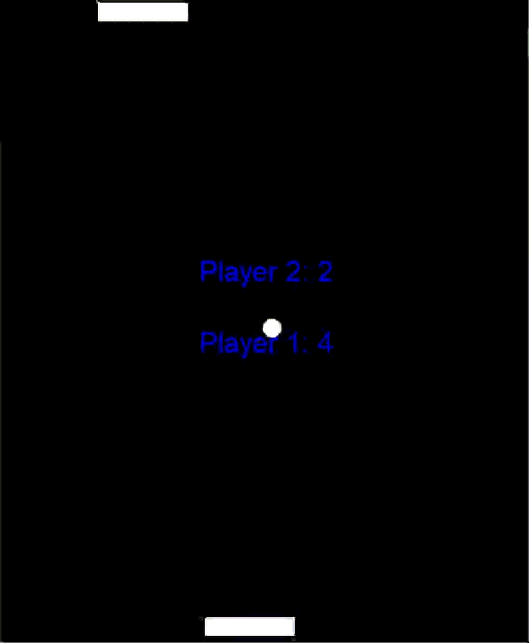

# 🏓 Python Pong

A classic two-player Pong game built with Python's `turtle` module. No external dependencies, no fuss — just clone it and play.

## Demo



## How to Play

Just run:

```bash
python Pong_Game.py
```

Two players, one keyboard:

| Player | Paddle | Left | Right |
|--------|--------|------|-------|
| Player 1 | Bottom paddle | `A` | `D` |
| Player 2 | Top paddle | `←` | `→` |

Hit `Esc` whenever you want to quit.

The ball bounces off the side walls, and every time it hits a paddle it speeds up a bit — so rallies get more chaotic the longer they go. Miss it on your side and the other player scores a point.

## Features

- Local two-player multiplayer
- Live scoreboard that updates as you play
- Ball speeds up with every paddle hit
- Simple, clean `turtle`-based graphics

## Requirements

- Python 3.x
- `turtle` (comes built into Python, nothing to install)

> On some Linux setups, `tkinter` isn't installed by default and `turtle` needs it. If you hit an import error:
> ```bash
> sudo apt-get install python3-tk
> ```

## What I Learned Building This

This was a fun one to build the logic out for. A few things that stood out:

## What Was Learned Building This


* Splitting the game into classes (`Ball`, `Paddle`, and `Scoreboard`) made the code easier to organize and maintain than one large script.

* Tracking **key presses and releases** made paddle movement smooth and continuous.

* **Collision detection** used distance checks between the ball and the paddle instead of pixel-perfect collisions.

* **Game speed** required careful tuning. The timing needed the right balance to keep the game fun and playable.


## License

This project is open source and available for learning purposes. Feel free to fork and modify it.
