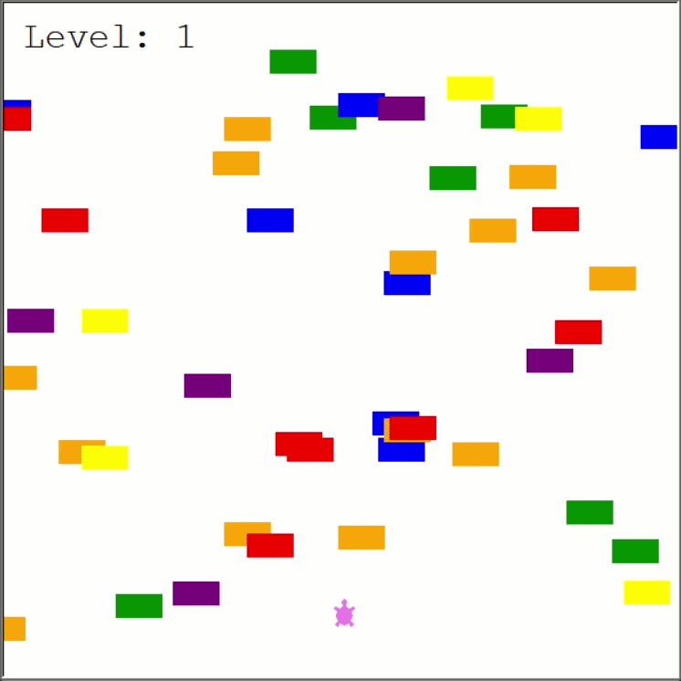

# Turtle Crossing Game 🐢

## How to Play

Use the **W** key to move the turtle forward.

The goal is to cross the road while avoiding traffic. Each time the turtle reaches the top of the screen, the player advances to the next level. As the levels increase, the cars move faster.

The game ends if the turtle collides with a moving car.

## Installation and Running
  1. Clone the repository:
      git clone https://github.com/your-username/Python_Projects.git
  2. Navigate to the project folder:
      cd Python_Projects/Turtle_crossing_game
  3. Run the game:
      python main.py

## Learning Outcomes

- Object-oriented programming (OOP)
- Collision detection
- Event handling with keyboard input
- Game loop implementation
- Level progression mechanics
- Modular code organization

